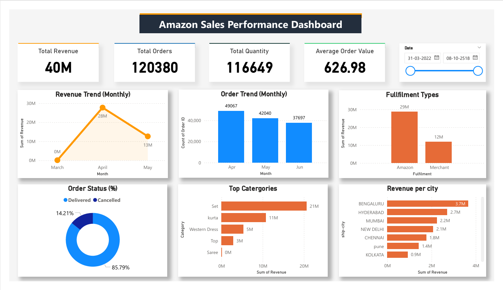

# 📊 Amazon Sales Performance Dashboard

## 📌 Project Overview
This project presents an interactive **Amazon Sales Dashboard** built using Power BI to analyze sales performance, customer behavior, and business insights.

The dashboard helps in tracking key metrics like revenue, orders, product categories, and city-wise sales distribution.

---

## 🚀 Features
- 📈 Revenue Trend Analysis (Monthly)
- 📦 Order Trend Tracking
- 🛒 Total Orders, Revenue, Quantity KPIs
- 💰 Average Order Value (AOV)
- 🏙️ Revenue by City
- 📊 Top Selling Categories
- 🚚 Fulfillment Type Analysis
- 📅 Date Range Filtering
- 📌 Order Status Distribution

---

## 📷 Dashboard Preview

---

## 🛠️ Tools & Technologies
- Power BI
- Data Cleaning & Transformation
- Data Visualization
- DAX (Data Analysis Expressions)

---

## 📊 Key Insights
- Highest revenue recorded in April (~28M)
- Majority orders are successfully delivered (~85%)
- Top category: **Set** contributing highest revenue
- Bengaluru is the top revenue-generating city
- Amazon fulfillment contributes more than Merchant

---

## 📂 Dataset
- Contains Amazon sales transaction data
- Includes fields like:
  - Order ID
  - Date
  - Category
  - City
  - Revenue
  - Quantity
  - Fulfillment Type

---

## 🎯 Purpose
This project is designed to:
- Showcase data visualization skills
- Demonstrate business insight generation
- Build a strong data analyst portfolio

---

## ⭐ If you like this project
Give it a ⭐ on GitHub!
